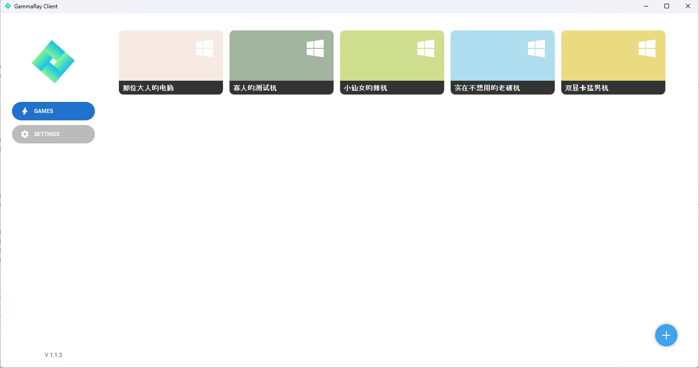
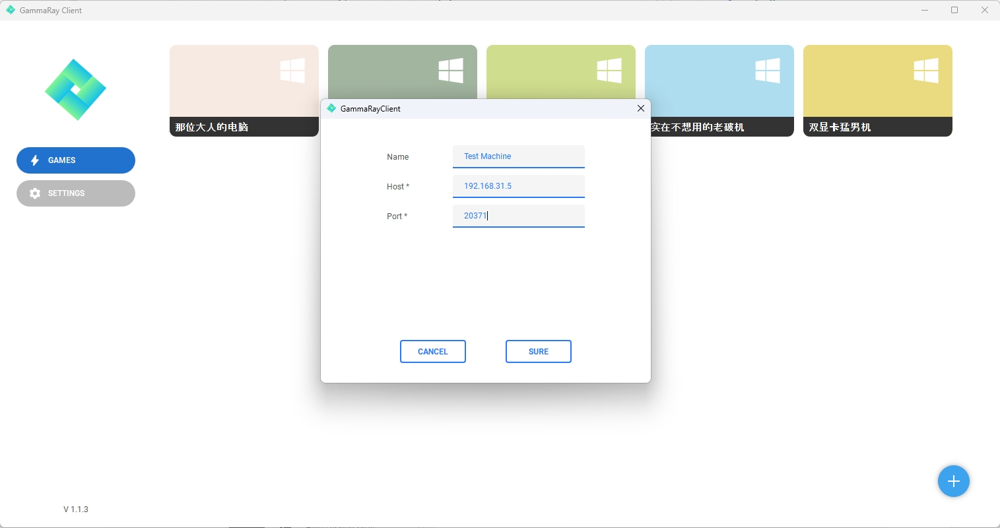
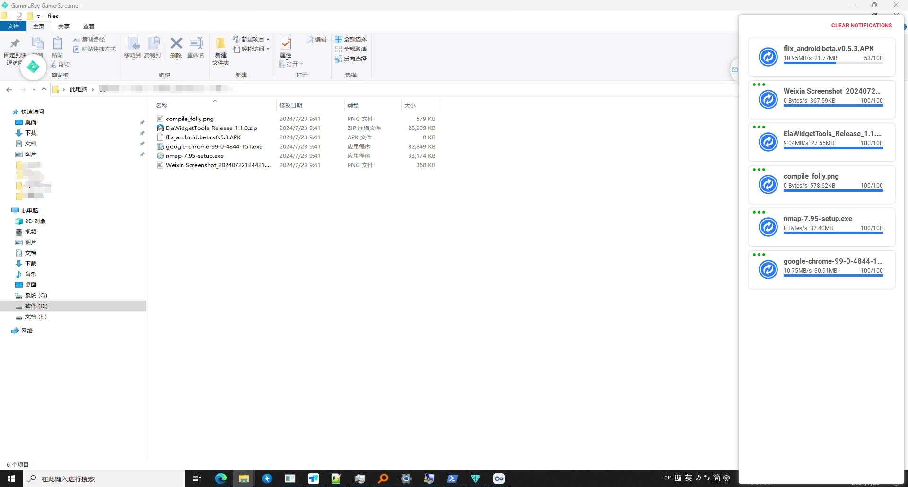

### GammaRay Client for PC platform
#### !!! Please visit the repos !!!
**[Server](https://github.com/RGAA-Software/GammaRay)**  
**[Android Client](https://github.com/RGAA-Software/GammaRayAndroid)**

#### 1 Run a PC Client
#### 1.1 Just double-clicked the GammaRayClient.exe in PC client folder


#### 1.2 Add a remote


#### 1.3 Double-click to connect it and operate it, you can also transfer files


#### How to build
#### 1. Clone the repo
```c++
    git clone --recursive ...
```

#### 2. Install dependencies by VCPKG *OR* use the libraries in [GammaRay]()
##### 2.1 Installing in this repo, please see [GammaRay]()
```c++
    cd {your-project-folder}/deps/tc_3rdparty/vcpkg
```
##### 2.2 Use exists in env_settings.cmake
```cmake
    set(VCPKG_ROOT D:/source/GammaRay/deps/tc_3rdparty/vcpkg)
```
##### 2.3 Set all env values
```cmake
    set(VCPKG_ROOT D:/source/GammaRay/deps/tc_3rdparty/vcpkg)
    set(QT_ROOT D:/Qt6.7/6.7.0/msvc2019_64)
    set(VK_SDK C:/VulkanSDK/1.3.275.0/Include)
```
